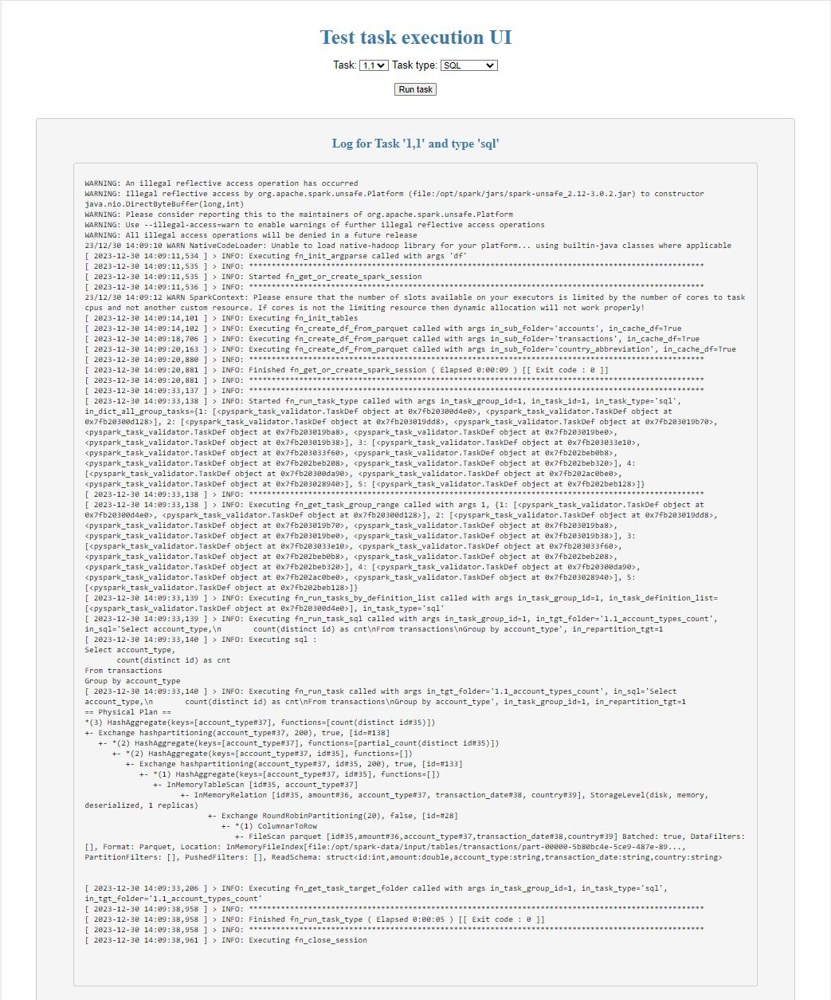

# Training project for Python core + flask

## Requirements:
* Docker 
  * on Linux 
  * on Windows with Ubuntu on WSL. Instruction is [here](https://ubuntu.com/tutorials/install-ubuntu-on-wsl2-on-windows-11-with-gui-support#1-overview) 
* 6 cores, 16 GB RAM for Spark cluster 
 
## Task 1: Python core + flask (hard)
**Summary:** Create UI using flask for execution bash commands in pyspark.

1. You need to write code in **src/main/web/app.py** and **src/main/web/templates/main.html**
2. Flask app need to be accessible from http://localhost:8000/run_task
3. You should have ability to
   1. Choose task from drop down list
   2. Choose method of execution (sql, dataframe or both) from drop down list
   3. Button to start execution
   4. See logs generated by your script in real time on your web page
4. For details how to run commands on docker refer to section below **"How to work with project"**
5. List of bash commands that you need to execute using Flask UI (one at a time)
```
# df
## group 1
spark-submit /opt/spark-apps/main/pyspark_task.py -g 1 -t 1 -tt df
spark-submit /opt/spark-apps/main/pyspark_task.py -g 1 -t 2 -tt df
## group 2    
spark-submit /opt/spark-apps/main/pyspark_task.py -g 2 -t 1 -tt df
spark-submit /opt/spark-apps/main/pyspark_task.py -g 2 -t 2 -tt df
spark-submit /opt/spark-apps/main/pyspark_task.py -g 2 -t 3 -tt df
spark-submit /opt/spark-apps/main/pyspark_task.py -g 2 -t 4 -tt df
spark-submit /opt/spark-apps/main/pyspark_task.py -g 2 -t 5 -tt df
## group 3
spark-submit /opt/spark-apps/main/pyspark_task.py -g 3 -t 1 -tt df      
spark-submit /opt/spark-apps/main/pyspark_task.py -g 3 -t 2 -tt df
spark-submit /opt/spark-apps/main/pyspark_task.py -g 3 -t 3 -tt df
spark-submit /opt/spark-apps/main/pyspark_task.py -g 3 -t 4 -tt df
spark-submit /opt/spark-apps/main/pyspark_task.py -g 3 -t 5 -tt df
## group 4
spark-submit /opt/spark-apps/main/pyspark_task.py -g 4 -t 1 -tt df
spark-submit /opt/spark-apps/main/pyspark_task.py -g 4 -t 2 -tt df
spark-submit /opt/spark-apps/main/pyspark_task.py -g 4 -t 3 -tt df

# sql
## group 1
spark-submit /opt/spark-apps/main/pyspark_task.py -g 1 -t 1 -tt sql
spark-submit /opt/spark-apps/main/pyspark_task.py -g 1 -t 2 -tt sql
## group 2    
spark-submit /opt/spark-apps/main/pyspark_task.py -g 2 -t 1 -tt sql
spark-submit /opt/spark-apps/main/pyspark_task.py -g 2 -t 2 -tt sql
spark-submit /opt/spark-apps/main/pyspark_task.py -g 2 -t 3 -tt sql
spark-submit /opt/spark-apps/main/pyspark_task.py -g 2 -t 4 -tt sql
spark-submit /opt/spark-apps/main/pyspark_task.py -g 2 -t 5 -tt sql
## group 3
spark-submit /opt/spark-apps/main/pyspark_task.py -g 3 -t 1 -tt sql      
spark-submit /opt/spark-apps/main/pyspark_task.py -g 3 -t 2 -tt sql
spark-submit /opt/spark-apps/main/pyspark_task.py -g 3 -t 3 -tt sql
spark-submit /opt/spark-apps/main/pyspark_task.py -g 3 -t 4 -tt sql
spark-submit /opt/spark-apps/main/pyspark_task.py -g 3 -t 5 -tt sql
## group 4
spark-submit /opt/spark-apps/main/pyspark_task.py -g 4 -t 1 -tt sql
spark-submit /opt/spark-apps/main/pyspark_task.py -g 4 -t 2 -tt sql
spark-submit /opt/spark-apps/main/pyspark_task.py -g 4 -t 3 -tt sql   
```
7. Example of desired solution :
   

## Task 2: PyTest
1. Understand implementation of config and tests for pytest ( conftest.py, test_app.py, pytest.ini )
    1. Fix bugs in current implementation as it doesn't work as expected.

       Command below need to run only specific tests + technical one (marked as Failed + test_fn_run_task_group_sql).        
       So in the data/output you should find only data/output/sql/task2/2.1... and data/output/sql/task1 (executed by test_fn_run_task_group_sql).
       > pytest /opt/spark-apps/test/test_app.py --task_type sql --task_group_id 2 --task_id 1
    2. Add parameter to skip tests that marked with **marks=pytest.mark.xfail**.
       > pytest /opt/spark-apps/test/test_app.py --task_type sql --task_group_id 2 --task_id 1 --skip-xfail
    3. Mark all tests in **test_app.py** except **test_task_data** as **technical**
    4. Add parameter **--skip-technical** to skip tests that marked **technical**.

       So in the data/output you should find only one folder data/output/sql/task2/2.1... if you implemented all correctly
       > pytest /opt/spark-apps/test/test_app.py --task_type sql --task_group_id 2 --task_id 1 --skip-technical
    5. Add parameter **--deselect-technical** to deselect tests that marked **technical**.

       So in the data/output you should find only one folder data/output/sql/task2/2.1... if you implemented all correctly
       > pytest /opt/spark-apps/test/test_app.py --task_type sql --task_group_id 2 --task_id 1 --deselect-technical


## How to work with project:
1. How to initialize the project :
    1. Permissions set 
       > chmod -R 755 ./*
    2. Docker image build
        1. Using prepared bash script
           > ./docker/start-docker.sh spark y

        2. Using docker commands
           ``` 
           docker build -f ./docker/DockerfileSpark  --build-arg SPARK_VERSION=3.0.2 --build-arg HADOOP_VERSION=3.2 -t cluster-apache-spark:3.0.2 ./                  
           ```     

2. How to start spark cluster
    1. Using prepared bash script
       > ./docker/start-docker.sh spark n
    2. Using docker commands
       ```
       docker compose -f ./docker/docker-compose-spark.yaml up -d
       docker container exec -it py_spark_test_tasks-spark-master-1 /bin/bash       
       spark-submit /opt/spark-apps/main/pyspark_task.py -g 1 -t 1 -tt df
       ```

3. How to use main script **pyspark_task.py**:
    ``` spark-submit /opt/spark-apps/main/pyspark_task.py -g <GROUP_ID> -t <TASK_ID> -tt <TASK_TYPE> ```
    1. GROUP_ID has values from list [1,2,3,4]
    2. TASK_ID has values 1 from 5, depends on task, not every group task has 5 tasks
    3. TASK_TYPE has values from list [df,sql]
    
    ```
    #Examples
    spark-submit /opt/spark-apps/main/pyspark_task.py -g 1 -t 1 -tt df
    spark-submit /opt/spark-apps/main/pyspark_task.py -g 1 -t 1 -tt sql   
    spark-submit /opt/spark-apps/main/pyspark_task.py -g 2 -t 1 -tt df
    spark-submit /opt/spark-apps/main/pyspark_task.py -g 3 -t 1 -tt sql   
    ``` 
4. How to run Pytest
   1. Start spark cluster
      > ./docker/start-docker.sh spark n
   2. Run pytest    
      > pytest /opt/spark-apps/test/test_app.py
5. Flask App to execute tasks from UI:
> http://localhost:8000/run_task
6. Spark Master UI
> http://localhost:9090/